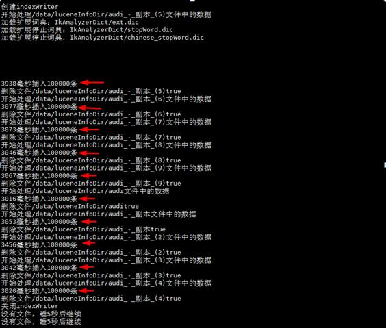

# Lucene
lucene企业级实战-解决mysql查询慢的轻量级框架（全文检索）

#lucene简介
        Lucene最初由鼎鼎大名Doug Cutting开发，2000年开源，现在也是开源全文检索方案的不二选择，
    它的特点概述起来就是：全Java实现、开源、高性能、功能完整、易拓展，功能完整体现在对分词的支持、各种查询方式（前缀、模糊、正则等）、打分高亮、列式存储（DocValues）等等。   
    而且Lucene虽已发展10余年，但仍保持着一个活跃的开发度，以适应着日益增长的数据分析需求，最新的6.0版本里引入block k-d trees，全面提升了数字类型和地理位置信息的检索性能，
    另基于Lucene的Solr和ElasticSearch分布式检索分析系统也发展地如火如荼，ElasticSearch也在我们项目中有所应用。

#File Structure
````
lucene
    |--- luceneInsert       数据插入模块
    |--- luceneInsertV2.0   数据插入模块
    |--- luceneQuery        性能检测模块
````
#性能
v1.0 性能分析：CentOS7.4、4核8G 3万条/秒<br>

